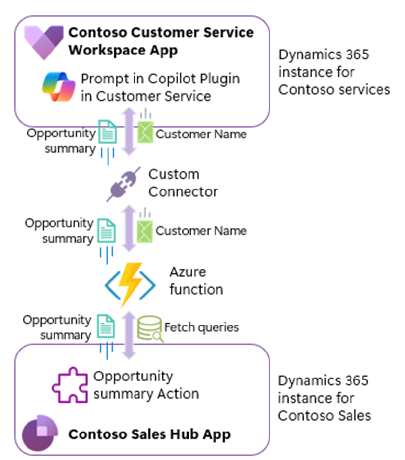

# Powering Cross Instance Collaboration with Copilot in Dynamics 365

**Authors:** Sourav Das Biswas & Sourajit Samanta, Senior FastTrack Architects

**Applies to:** Customer Service Workspace and Dynamics 365 Sales.

This article shows a solution that helps you enhance team collaboration and customer experience with contextual insights for agents across multiple Dynamics 365 CE instances.

## Introduction

In today’s interconnected business landscape, seamless collaboration across departments and systems is essential for delivering exceptional customer experiences and driving growth. However, when different business units operate within separate Dynamics 365 instances, achieving this level of collaboration can be challenging. This is one scenario where Microsoft Copilot comes into play, acting as a bridge that enhances communication and workflow between teams, ensuring that valuable customer insights are shared and utilized effectively.

In this article, we’ll explore how Copilot can act as a bridge between teams working in different Dynamics 365 instances to drive better collaboration and results.

## Scenario

Contoso, a global leader in its industry, operates with two key business units: Service Management and Sales. The Service Management team focuses on delivering top-notch customer support, while the Sales team is dedicated to driving revenue growth through strategic client engagement. To cater to their unique needs, each unit operates within its own Dynamics 365 instance, tailored specifically for their functions.

Here’s how Copilot transforms collaboration at Contoso:

Imagine a service agent named Emma from the Service Management team. While handling a customer’s request, Emma uses Copilot to access a comprehensive view of the customer’s profile—including their purchase history, preferences, and prior interactions. Additionally, Emma receives opportunity insights related to the customer from the Sales instance of Dynamics 365. With this information at her fingertips, Emma not only resolves the issue efficiently but also identifies potential cross-sell and up-sell opportunities relevant to the customer.

Instead of these insights being confined to the Service Management instance, Copilot ensures that they are seamlessly shared with the Sales team operating in a separate Dynamics 365 instance. The Sales team can then follow up with tailored offers or engagement strategies, leveraging Emma’s insights to build stronger relationships and drive additional revenue.

This synergy between Service Management and Sales, powered by Copilot, not only enhances the customer experience but also aligns the efforts of both teams toward Contoso’s overarching business goals. The result? A collaborative ecosystem that turns customer interactions into growth opportunities.

## Solution Architecture

### Approach

The Customer Service Copilot plugin extension is used to consume data from Contoso Sales Dynamics 365 instance. The plugin utilizes a custom connector to invoke an Azure Function, which retrieves data from the Sales instance. An out-of-the-box opportunity summary plugin, `msdyn_SalesOpportunitySummary`, is invoked to summarize opportunity-related information based on the specified customer name. The opportunity summary is then returned as a response to the prompt in the Customer Service Workspace (CSW) Copilot pane.



## Implementation Steps

### Step 1: Create the Azure Function

Follow the steps below to create a sample Azure function that retrieves opportunity details from the Dynamics 365 sales solution hosted in a separate Dynamics CE instance.

- Create a new Azure Functions project in Visual Studio 2022 with an HTTP trigger, version 4.0, and a .NET 8.0 isolated function worker.
- Install the `Microsoft.Azure.WebJobs.Extensions.OpenApi.Core` NuGet package in the project.
- Include Open API attributes in the function class to specify the operation, security, and input/output parameters.
  ```csharp
  [Function("DealSummary")]
  [OpenApiOperation(operationId: "DealSummary")]
  [OpenApiSecurity("function_key", SecuritySchemeType.ApiKey, Name = "code", In = OpenApiSecurityLocationType.Query)]
  [OpenApiParameter(name: "customerName", In = ParameterLocation.Query, Required = false, Type = typeof(string), Description = "customerName")]
  [OpenApiResponseWithBody(statusCode: HttpStatusCode.OK, contentType: "text/plain", bodyType: typeof(Response), Description = "Deal Summary for a customer")]
  ```
- Fetch the opportunity record ID from the Contoso Sales environment by executing a query based on the parameter provided to the Azure Function. In this example, we have retrieved the top opportunity record for a specified customer.
- Invoke the out-of-the-box (OOB) “msdyn_SalesOpportunitySummary” action by providing the opportunity ID and obtain the summarized response. Below is the sample.
  ```csharp
    Guid opportunityId = opportunity.Id;
    var executeSalesOpportunitySummaryAction = new OrganizationRequest()
    {
        RequestName = "msdyn_SalesOpportunitySummary"
    };
    executeSalesOpportunitySummaryAction.Parameters.Add("msdyn_id", opportunityId.ToString()); // Retrieved Opportunity Record Id.
    executeSalesOpportunitySummaryAction.Parameters.Add("msdyn_activityId", opportunityId.ToString()); // Retrieved Opportunity Record Id.
    try
    {
        var summaryResponse = this.dataverseProvider.ExecuteAsync(executeSalesOpportunitySummaryAction);
        summarizedResponse = summaryResponse == null ? string.Empty : summaryResponse.Results["msdyn_summary_raw"].ToString();
    }
    catch (Exception ex)
    {
        logger.LogTrace(ex, $"OpportunitySummaryProcessor > Error generating summary for Opportunity {opportunityId}: {ex.Message}. StackTrace: {ex.StackTrace}");

    }
  ```
- Publish the Azure Function to Azure and retrieve the Swagger file from the hosted function app at https://XX-XXX-demo.azurewebsites.net/api/swagger.json.

### Step 2: Create a Custom Connector

Use the following steps to create a customer connector for the...

- Go to the maker portal (https://make.powerapps.com) and create a new custom connector. Choose “create from blank”.
- Provide a name, for example, “Summarize Deal” and click on continue.
- Provide a meaningful description, as it will be used by Copilot to identify the plugin. For example, “Summarize the deal details for a specific customer in a paragraph”.
- Click on the “Security” page and choose the appropriate authentication type. 
- Create a new action. Provide a meaningful summary and description, then switch to the Swagger editor. Copy and paste the Swagger file content from Step 1 where you created the Azure function.
- Once you toggle back the “Swagger editor” you’ll notice a new action and request is created.
- Validate the response from the Azure function.
- Click on the “AI Plugin (preview)” page and provide a meaningful name and description. For example, you can use name as “Summarize the deal details” and in the description you can specify “Summarize the deal details for a specific customer in a paragraph”.
- Click on “Plugin Actions” and check “Enable as copilot plugin operation”.
- Validate the request details.
- Click on “Update connector” to complete the creation of the connector. Once the process completes successfully, you will be able to see your connector listed under the custom connectors list.

### Step 3: Verify and Publish the Custom Connector

Use the following steps to verify and publish the custom connector 

- Go to the copilot studio (https://copilotstudio.microsoft.com). Choose the correct environment.
- Click on “Agents” from the left navigation and select “Copilot in Dynamics 365 Customer Service”.
- Use Copilot in Dynamics 365 Customer Service to create a Connector action.
- Select the custom connector created in Step 2 within the Dataverse environment and configure its actions and parameters.
- Verify the custom connector details, edit if required, and publish the changes.

### Step 4: Configure the Custom Plugin

Use the following steps to configure the custom plugin

- Go to the Customer Service Admin app and click on “Manage Plugins for Generative AI (preview)” under Agent experience > Productivity. 
- You will be able to see the custom plugin listed here. In our case “Summarize Deal” plugin. Next, turn on the plugin by following the 4 steps in the wizard:
- Select the authentication as “Admin” or “Agent”.
- Choose the access type as “All agents who have Copilot” or specific security roles as appropriate.
- Click on “Save” to complete the configuration. Ensure the custom plugin status is turned on.

### Step 5: Test the Plugin

Test the plugin by creating a prompt in Copilot and asking a question, such as “Get me details about deal for the <customer name>”. If you have done all the configurations correctly, then you should be able to see the summary of the opportunity related to the specified customer in the chat window.

## Conclusion

By following these steps, you can successfully implement cross-instance collaboration with Copilot in Dynamics 365, enhancing team collaboration and delivering a superior customer experience.